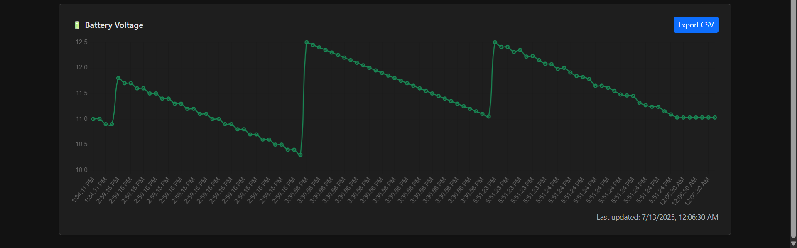
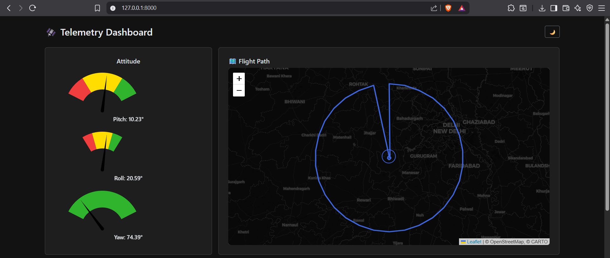

# 🛰️ Telemetry API for Embedded Devices

## Overview
A Django-based backend API to receive and serve telemetry data (GPS, battery, orientation) from embedded systems like drones or IoT sensors.

## Features
- `/api/telemetry` [POST] — log data (batch or unit)
- `/api/telemetry/all` [GET] — fetch all
- `/api/telemetry/<count:int>` [GET] — fetch count number of log data
- `/api/telemetry/latest` [GET] — fetch latest log data
- SQLite backend
- JSON-ready, REST-compliant

## Sample Payload

```json
{
  "lat": 28.460625,
  "lon": 76.789715,
  "battery_voltage": 11.03,
  "pitch": 10.23,
  "yaw": 74.39,
  "roll": 20.59
}
```
---

## 🖼️ Screenshots

Here are some sample dashboard screenshots

<div style="display: flex; gap: 20px; justify-content: space-between; align-items: center;">

  

  

</div>
---
